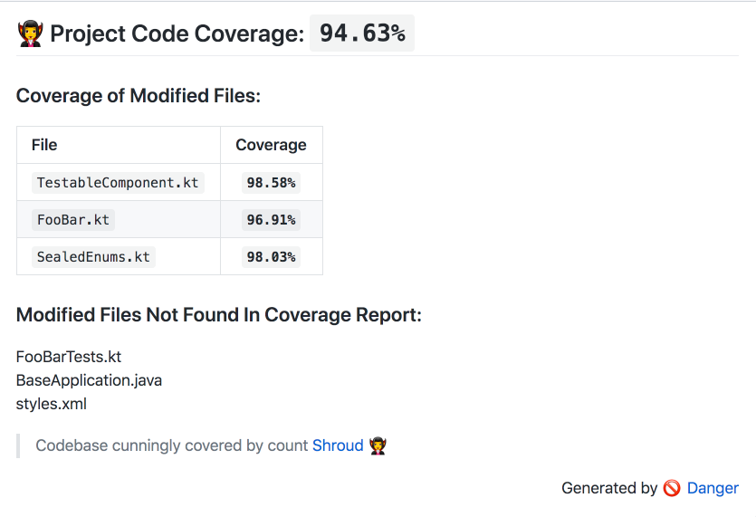

- [danger-shroud](#danger-shroud)
  - [Installation](#installation)
  - [Usage Kover](#usage-kover)
    - [Parameters](#parameters)
    - [Examples](#examples)
  - [Usage Jacoco](#usage-jacoco)
    - [Parameters](#parameters-1)
    - [Examples](#examples-1)
  - [Development](#development)
  - [Versioning](#versioning)

# danger-shroud

A danger plugin for enforcing code coverage coverage via a Kover or Jacoco coverage report.



## Installation

Add this line to your application's Gemfile:

```ruby
gem 'danger-shroud'
```

## Usage Kover

Shroud depends on having a Kover coverage report generated for your project. For Android projects, [kotlinx-kover](https://github.com/Kotlin/kotlinx-kover) works well. 

### Parameters

You can use the following parameters to control how shroud operates:

| Param                       | Type    | Description                                                                                 | Example                      |
|-----------------------------|---------|---------------------------------------------------------------------------------------------|------------------------------|
| moduleName                  | String  | the display name of the project or module.                                                  | `'Module Name '`             |
| file                        | String  | file path to a Kover xml coverage report.                                                   | `'path/to/kover/report.xml'` |
| totalProjectThreshold       | Integer | defines the required percentage of total project coverage for a passing build.              | default `90`                 |
| modifiedFileThreshold       | Integer | defines the required percentage of files modified in a PR for a passing build.              | default `90`                 |
| failIfUnderProjectThreshold | Boolean | if true, will fail builds that are under the provided thresholds. if false, will only warn. | default `true`               |
| failIfUnderFileThreshold    | Boolean | if true, will fail builds that are under the provided thresholds. if false, will only warn. | default `true`               |
| coverageType                | enum    | the type of coverage to use (:branch, :class, :instruction, :line, and :method).            | default `:line`       |

### Examples

Running shroud with default values:

```ruby
# Report coverage of modified files, fail if either total 
# project coverage or any modified file's coverage is under 90%
shroud.reportKover moduleName: 'Module Name', file: 'path/to/kover/report.xml'
```

Running shroud with custom coverage thresholds:

```ruby
# Report coverage of modified files, fail if total project coverage is under 80%,
# or if any modified file's coverage is under 95%
shroud.reportKover moduleName: 'Module Name', file: 'path/to/kover/report.xml', totalProjectThreshold: 80, modifiedFileThreshold: 95
```

Warn on builds instead of fail:

```ruby
# Report coverage of modified files the same as the above example, except the
# builds will only warn instead of fail if below project thresholds
shroud.reportKover moduleName: 'Module Name', file: 'path/to/kover/report.xml', totalProjectThreshold: 80, modifiedFileThreshold: 95, failIfUnderProjectThreshold: false, failIfUnderFileThreshold: false
```

## Usage Jacoco

### Parameters

You can use the following parameters to control how shroud operates:

| Param                       | Type    | Description                                                                                 | Example                       |
|-----------------------------|---------|---------------------------------------------------------------------------------------------|-------------------------------|
| moduleName                  | String  | the display name of the project or module.                                                  | `'Module Name '`              |
| file                        | String  | file path to a Jacoco xml coverage report.                                                  | `'path/to/jacoco/report.xml'` |
| totalProjectThreshold       | Integer | defines the required percentage of total project coverage for a passing build.              | default `90`                  |
| modifiedFileThreshold       | Integer | defines the required percentage of files modified in a PR for a passing build.              | default `90`                  |
| failIfUnderProjectThreshold | Boolean | if true, will fail builds that are under the provided thresholds. if false, will only warn. | default `true`                |
| failIfUnderFileThreshold    | Boolean | if true, will fail builds that are under the provided thresholds. if false, will only warn. | default `true`                |
| coverageType                | enum    | the type of coverage to use (:branch, :class, :instruction, :line, and :method).            | default `:line`        |

### Examples

Shroud depends on having a Jacoco coverage report generated for your project. For Android projects, [jacoco-android-gradle-plugin](https://github.com/arturdm/jacoco-android-gradle-plugin) works well. 

Running shroud with default values:

```ruby
# Report coverage of modified files, fail if either total 
# project coverage or any modified file's coverage is under 90%
shroud.reportJacoco moduleName: 'Module Name', file: 'path/to/jacoco/report.xml'
```

Running shroud with custom coverage thresholds:

```ruby
# Report coverage of modified files, fail if total project coverage is under 80%,
# or if any modified file's coverage is under 95%
shroud.reportJacoco moduleName: 'Module Name', file: 'path/to/jacoco/report.xml', totalProjectThreshold: 80, modifiedFileThreshold: 95
```

Warn on builds instead of fail:

```ruby
# Report coverage of modified files the same as the above example, except the
# builds will only warn instead of fail if below thresholds
shroud.reportJacoco moduleName: 'Module Name', file: 'path/to/jacoco/report.xml', totalProjectThreshold: 80, modifiedFileThreshold: 95, failIfUnderProjectThreshold: false, failIfUnderFileThreshold: false
```

## Development

1. Clone this repo
2. Run `bundle install` to setup dependencies.
3. Run `bundle exec rake spec` to run the tests.
4. Use `bundle exec guard` to automatically have tests run as you make changes.
5. Make your changes.

## Versioning

This repository conforms to the semantic versioning convention:

```
v[MAJOR].[MINOR].[PATCH]
```

where

      [MAJOR]   is incremented when an incompatible API change is made or a major milestone that significantly changes the library is achieved.

      [MINOR]   is incremented when new functionality is introduced in a backward-compatible manner.

      [PATCH]   is incremented when a backward-compatible bug fix is introduced.

All updates should have a corresponding CHANGELOG.md entry that at a high-level describes what is being newly introduced in it.

When incrementing a level any lower-levels should always reset to 0.
