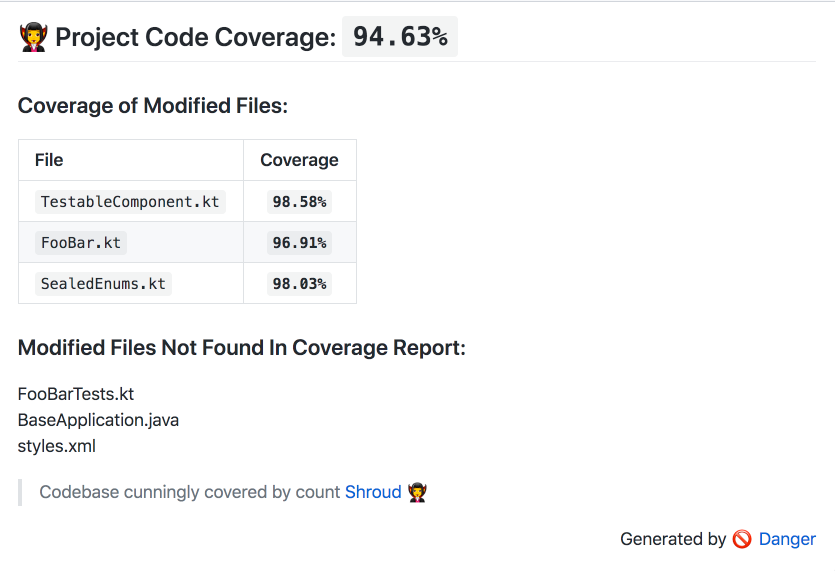

- [danger-shroud](#danger-shroud)
  - [Installation](#installation)
  - [Configuration](#configuration)
  - [Usage Kover](#usage-kover)
    - [Parameters](#parameters)
    - [Examples](#examples)
  - [Usage Jacoco](#usage-jacoco)
    - [Parameters](#parameters-1)
    - [Examples](#examples-1)
  - [Development](#development)
  - [Versioning](#versioning)

# danger-shroud

A danger plugin for enforcing code coverage coverage via a Kover or Jacoco coverage report.



## Installation

Add this line to your application's Gemfile:

```ruby
gem 'danger-shroud'
```

## Configuration

Shroud will default to using the filepath of your coverage report to determine which module the reported files belong to. This assumes that your Jacoco or Kover configuration will output to the default `build/reports/` directory when generating reports.

If you have a custom configuration that outputs the reports somewhere else, you can provide the module's path with the `moduleDirectory` parameter. This allows the plugin to accurately determine the module in which a file is located by matching it to the file's path prefix. A custom report location that does not have a `moduleDirectory` specified may result in files being reported in modules they do not belong to.

## Usage Kover

Shroud depends on having a Kover coverage report generated for your project. For Android projects, [kotlinx-kover](https://github.com/Kotlin/kotlinx-kover) works well. 

### Parameters

You can use the following parameters to control how shroud operates:

| Param                       | Type    | Description                                                                                 | Example                      |
|-----------------------------|---------|---------------------------------------------------------------------------------------------|------------------------------|
| moduleName                  | String  | the display name of the project or module.                                                  | `'Module Name '`             |
| moduleDirectory             | String, nil  | file path to the module to specify its location when its report `file` outputs to a custom directory.                     | default `nil`.               |
| file                        | String  | file path to a Kover xml coverage report.                                                   | `'path/to/kover/report.xml'` |
| totalProjectThreshold       | Integer | defines the required percentage of total project coverage for a passing build.              | default `90`                 |
| modifiedFileThreshold       | Integer | defines the required percentage of files modified in a PR for a passing build.              | default `90`                 |
| failIfUnderProjectThreshold | Boolean | if true, will fail builds that are under the provided thresholds. if false, will only warn. | default `true`               |
| failIfUnderFileThreshold    | Boolean | if true, will fail builds that are under the provided thresholds. if false, will only warn. | default `true`               |
| coverageType                | enum    | the type of coverage to use (:branch, :class, :instruction, :line, and :method).            | default `:line`       |

### Examples

Running shroud with default values:

```ruby
# Report coverage of modified files, fail if either total 
# project coverage or any modified file's coverage is under 90%
shroud.reportKover moduleName: 'Module Name', file: 'module/build/reports/kover/report.xml'
```

Running shroud with custom coverage thresholds:

```ruby
# Report coverage of modified files, fail if total project coverage is under 80%,
# or if any modified file's coverage is under 95%
shroud.reportKover moduleName: 'Module Name', file: 'module/build/reports/kover/report.xml', totalProjectThreshold: 80, modifiedFileThreshold: 95
```

Warn on builds instead of fail:

```ruby
# Report coverage of modified files the same as the above example, except the
# builds will only warn instead of fail if below project thresholds
shroud.reportKover moduleName: 'Module Name', file: 'module/build/reports/kover/report.xml', totalProjectThreshold: 80, modifiedFileThreshold: 95, failIfUnderProjectThreshold: false, failIfUnderFileThreshold: false
```

Running shroud with a Kover report file in a custom directory:

```ruby
# Report coverage of modified files, specifying an explicit path to the module
# when the coverage report won't be inside of its `build/reports/` directory
shroud.reportKover moduleName: 'Module Name', moduleDirectory: 'module/', file: 'custom/path/to/kover/report.xml'
```

## Usage Jacoco

### Parameters

You can use the following parameters to control how shroud operates:

| Param                       | Type    | Description                                                                                 | Example                       |
|-----------------------------|---------|---------------------------------------------------------------------------------------------|-------------------------------|
| moduleName                  | String  | the display name of the project or module.                                                  | `'Module Name '`              |
| moduleDirectory             | String, nil  | file path to the module to specify its location when its report `file` outputs to a custom directory.                     | default `nil`.                |
| file                        | String  | file path to a Jacoco xml coverage report.                                                  | `'path/to/jacoco/report.xml'` |
| totalProjectThreshold       | Integer | defines the required percentage of total project coverage for a passing build.              | default `90`                  |
| modifiedFileThreshold       | Integer | defines the required percentage of files modified in a PR for a passing build.              | default `90`                  |
| failIfUnderProjectThreshold | Boolean | if true, will fail builds that are under the provided thresholds. if false, will only warn. | default `true`                |
| failIfUnderFileThreshold    | Boolean | if true, will fail builds that are under the provided thresholds. if false, will only warn. | default `true`                |
| coverageType                | enum    | the type of coverage to use (:branch, :class, :instruction, :line, and :method).            | default `:line`        |

### Examples

Shroud depends on having a Jacoco coverage report generated for your project. For Android projects, [jacoco-android-gradle-plugin](https://github.com/arturdm/jacoco-android-gradle-plugin) works well. 

Running shroud with default values:

```ruby
# Report coverage of modified files, fail if either total 
# project coverage or any modified file's coverage is under 90%
shroud.reportJacoco moduleName: 'Module Name', file: 'project/module/reports/jacoco/report.xml'
```

Running shroud with custom coverage thresholds:

```ruby
# Report coverage of modified files, fail if total project coverage is under 80%,
# or if any modified file's coverage is under 95%
shroud.reportJacoco moduleName: 'Module Name', file: 'module/reports/jacoco/report.xml', totalProjectThreshold: 80, modifiedFileThreshold: 95
```

Warn on builds instead of fail:

```ruby
# Report coverage of modified files the same as the above example, except the
# builds will only warn instead of fail if below thresholds
shroud.reportJacoco moduleName: 'Module Name', file: 'module/reports/jacoco/report.xml', totalProjectThreshold: 80, modifiedFileThreshold: 95, failIfUnderProjectThreshold: false, failIfUnderFileThreshold: false
```

Running shroud with a Jacoco report file in a custom directory:

```ruby
# Report coverage of modified files, specifying an explicit path to the module
# when the coverage report won't be inside of its `build/reports/` directory
shroud.reportKover moduleName: 'Module Name', moduleDirectory: 'module/', file: 'custom/path/to/jacoco/report.xml'
```

## Development

1. Clone this repo
2. Run `bundle install` to setup dependencies.
3. Run `bundle exec rake spec` to run the tests.
4. Use `bundle exec guard` to automatically have tests run as you make changes.
5. Make your changes.

## Versioning

This repository conforms to the semantic versioning convention:

```
v[MAJOR].[MINOR].[PATCH]
```

where

      [MAJOR]   is incremented when an incompatible API change is made or a major milestone that significantly changes the library is achieved.

      [MINOR]   is incremented when new functionality is introduced in a backward-compatible manner.

      [PATCH]   is incremented when a backward-compatible bug fix is introduced.

All updates should have a corresponding CHANGELOG.md entry that at a high-level describes what is being newly introduced in it.

When incrementing a level any lower-levels should always reset to 0.
